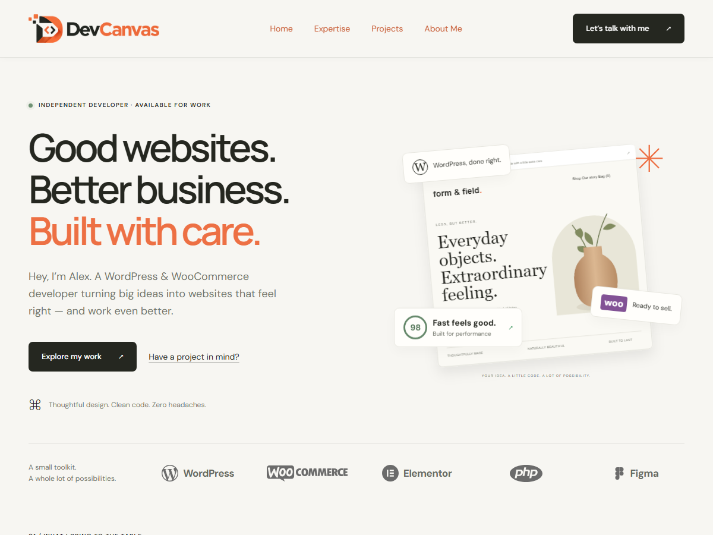

# DevCanvas — WordPress Portfolio Theme

DevCanvas is a classic WordPress theme for a developer portfolio, built with AI assistance from the original HTML design. It includes editable Homepage and Projects page templates, a project custom post type, a customizable header and footer, and a contact area that accepts a form plugin shortcode.

## Installation

1. Download the repository ZIP and extract it.
2. Ensure the theme folder contains `style.css`, `functions.php`, and `index.php` directly inside it. Name the folder `devcanvas`.
3. Upload that folder to `wp-content/themes/`, or ZIP the folder and upload it through **Appearance → Themes → Add New → Upload Theme**.
4. Activate **DevCanvas**.

No build command, Node.js dependency, ACF, or page builder is required to use the theme. A form plugin is needed only for the embedded contact form. The theme loads DM Sans and Manrope from Google Fonts, so those fonts require an internet connection.

The repository contains theme files, not the site's database, Media Library, pages, menus, or installed plugins. Existing sample projects on the development site are not automatically created on a new installation.

## First-time setup

1. Create a page, select the **Homepage** template in the page settings, and save it.
2. Open **Homepage — Section Settings** in the editor's meta boxes and customize the sections below.
3. Under **Settings → Reading**, choose **A static page** and select that page as your homepage.
4. Create another page, select the **Projects** template, and publish it. Its slug can be `projects` or another name you choose.
5. Set the homepage's **Projects → Supporting Text & Button → Button URL** to that Projects page URL.
6. Add your projects under **Projects → Add New Project**.
7. Configure the header, footer, and menu as described below.

Always save or update a page after changing its section settings. Settings belong to each individual page. The Homepage and Projects templates render their dedicated settings rather than the ordinary page editor content.

## Header, footer, and navigation

Open **Appearance → Customize → Header & Footer** to manage:

- Header logo and footer logo independently through the Media Library.
- Header button text and URL. Leave either blank to hide the button; the desktop menu then aligns to the right.
- Footer copyright. Use `{year}` for the current year, or leave the field blank to hide the text.

Customizer pencil shortcuts are registered through WordPress selective refresh for the logos, header button, and copyright. The menu uses WordPress's menu editing shortcut. Without a selected logo, the theme displays its default text branding.

Under **Appearance → Menus**, create a menu and assign it to **Header Menu**. The header includes a mobile menu. The footer's **Back to top** link returns to the document top.

Homepage section anchors are `#home`, `#expertise`, `#projects`, `#about`, and `#contact`. For links that must also work from the Projects page, use the homepage URL plus the anchor, for example `https://your-site.example/#contact`.

## Homepage settings

The settings are organized into six main groups, with collapsible subgroups.

| Group | Editable content |
| --- | --- |
| Hero | Availability, heading lines, orange heading, introduction, primary and secondary links, supporting note, hero image and alternative text, floating badge labels and icons |
| Toolkit | Section visibility and introduction; five individual items with visibility, accessible name, visible label, logo image, and optional link |
| Services | Section visibility, label, heading, description, and repeatable service cards |
| Projects | Section visibility, label, heading, All filter label, empty message, supporting text, and button |
| About | Section visibility, label, heading, paragraphs, highlights, link, decorative code-card text, and sticker |
| Contact | Section visibility, headings, description, email, copy-button label, availability, form shortcode, and text above/below the form |

Use one line per entry where a field asks for separate heading lines, tags, highlights, or code-card values. Optional blank fields are omitted where supported. Image fields provide **Choose image** and **Remove image** controls. Use meaningful alternative text for the hero image.

### Floating badges

Upload custom images for the WordPress, WooCommerce, and performance badges. Blank badge image fields use their defaults. A custom performance image replaces the numeric score; removing it restores the score.

### Repeatable services

In **Services**, add as many service cards as needed. Each card has visibility, title, description, optional number, image icon, text/symbol fallback, and tags entered one per line. Use the row controls to add, remove, or move cards up and down, then update the page. Older saved three-card settings are retained as a fallback until repeatable rows are saved.

The Toolkit currently has five fixed item slots; it is not a repeater.

## Managing projects

Use **Projects → Add New Project** to enter:

- **Title** — the card heading.
- **Project Featured Image** — the project preview. Set its alternative text in the Media Library.
- **Project Categories** — hierarchical categories used by the filters and card labels.
- **Project Tags** — non-hierarchical tags displayed beneath the excerpt.
- **Excerpt** — the short card description.
- **Project Details → Live Website Link** — a text field for the destination URL.

Publish the project to make it appear. When a live URL is supplied, the entire card links to it in the current tab. A blank URL leaves the card unlinked. `#` can be used as a placeholder, but does not open a live website.

Projects do not have public single-project detail pages. The full collection is a normal WordPress page using the **Projects** template, not a built-in custom post type archive.

### Homepage filters and limits

The homepage shows the latest **four** published projects. Selecting a category shows the latest **four matching projects**, or fewer if fewer exist. Categories are collected from published projects and sorted alphabetically. A project assigned to multiple categories can match each of those filters. Ordering uses publication date, with post ID as a tie-breaker.

Filtering happens in the browser. The theme loads all published project cards so a category can find matches beyond the initial four. JavaScript is required for the filter controls; without it, the homepage retains its initial four cards. For a very large portfolio, server-side filtering and pagination would need to be added.

## Projects collection page

Choose the **Projects** template on any page. Edit **Projects — Page Settings** to change:

- **Introduction:** back-link text, section label, heading, accent heading, and description.
- **Collection:** project count label, heading, All filter label, empty state, and supporting note. `{count}` inserts the total number of published projects.
- **Contact:** call-to-action label, heading, description, button text, and URL.

This page displays all published projects and filters them by category without the homepage's four-card limit. It currently has no pagination. Manage the actual cards in the Projects admin menu, not in the page settings.

## Contact form shortcode

1. Install and activate JetFormBuilder, Contact Form 7, or another plugin that provides a form shortcode.
2. Create the form in that plugin. Configure fields, validation, recipient, submission actions, and success messages there.
3. Copy the shortcode supplied by the plugin.
4. Edit your Homepage page and open **Contact → Form Shortcode & Text**.
5. Paste the shortcode into **Form shortcode**, adjust the panel heading/introduction/note, and update the page.
6. Test a submission and confirm delivery using the plugin's settings.

To switch plugins later, activate the replacement plugin and replace the shortcode. No theme PHP edit is needed. The theme provides shared styling for common form elements, including JetFormBuilder and Contact Form 7, but unusual fields or plugin layouts may need additional styling.

The theme does not create forms or send email itself. Without a working shortcode, editors see setup guidance and visitors see an email fallback when an email address is configured. Ensure any note below the form accurately describes the chosen plugin's behavior.

The **Copy email** button copies the configured contact email and announces the result. It uses the Clipboard API when available, with a fallback for local HTTP sites. Browser restrictions can still prevent copying; in that case it displays the address for manual copying.

## Files and data

| File or directory | Purpose |
| --- | --- |
| `style.css` | WordPress theme metadata and shared/header/footer styles |
| `functions.php` | Theme support, menus, asset loading, Customizer settings and selective refresh |
| `header.php`, `footer.php` | Shared page shell, branding, navigation, copyright and top link |
| `index.php` | Basic fallback WordPress content loop |
| `templates/template-homepage.php` | Homepage layout, hero, toolkit, services and section includes |
| `templates/template-projects.php` | Full project collection page |
| `inc/homepage-settings.php` | Homepage field definitions, admin groups and saving |
| `inc/services-repeater.php` | Service repeater controls, data and sanitization |
| `inc/projects.php` | Project post type, categories, tags and live-link field |
| `inc/projects-page-settings.php` | Editable Projects page settings |
| `inc/homepage-projects.php` | Shared project collection/card rendering |
| `inc/homepage-about.php`, `inc/homepage-contact.php` | About and shortcode contact sections |
| `assets/homepage.css` | Homepage and project collection styles |
| `assets/homepage-admin.js`, `assets/homepage-admin.css` | Page settings, image picker and repeater interface |
| `assets/projects.js` | Category filtering and visible-card limits |
| `assets/contact.js` | Email copy behavior |
| `navigation.js` | Mobile navigation behavior |
| `assets/logos/`, `assets/hero-store.svg` | Bundled design assets |
| `screenshot.png` | Homepage preview shown in the WordPress theme browser |

Homepage fields are stored in page meta `_devcanvas_homepage`; service rows in `_devcanvas_services`; collection page fields in `_devcanvas_projects_page`. The project post type is `devcanvas_project`, with `project_category` and `project_tag` taxonomies. Live URLs use `_devcanvas_live_website_link`. Customizer values use `devcanvas_` theme modifications.

Save handlers verify nonces and editing permissions and sanitize submitted values. Templates escape text and URLs; contact form markup is rendered by the active shortcode plugin.

## Maintenance and troubleshooting

- **Settings missing:** select the correct page template, save, and reload the editor. Look in the editor's meta boxes below the content area.
- **Projects missing:** check that they are published, the homepage section is enabled, and the expected category is assigned. Remember the homepage limit is four per filter.
- **Form missing:** confirm the plugin is active and the exact shortcode is saved on the page being displayed.
- **Links point to the wrong page:** replace sample URLs and use full homepage URLs for cross-page section links.
- **Styles appear old:** clear any site/browser cache. Homepage and supporting script assets use file modification times; the base stylesheet and navigation script use the theme version.
- **Moving the site:** migrate the database and Media Library as well as the theme. Uploaded image URLs and page links may need replacement through your migration tool.
- **Changing themes:** project data remains in the database, but its admin registration belongs to DevCanvas. Move the post type registration into a site plugin if it must remain available independently of this theme.

Back up files and the database before updates. There is no build step or bundled automated test suite. For code changes, lint PHP files, syntax-check JavaScript, and verify responsive layouts, page setting saves, project filtering, navigation, and form delivery.

## License and attribution

Theme metadata declares **GPL v2 or later**. Third-party brand assets remain subject to their respective rights; see [asset attribution](assets/logos/README.md). Replace the sample identity, portfolio content, email, and links with your own before launch.
